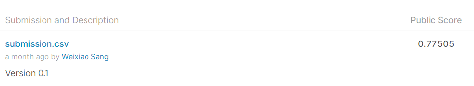

+++
date: 2020-2-20
title: Real or Not? NLP with Disaster Tweets
+++

Real or Not? NLP with Disaster Tweets

Score 0.77505


```

import numpy as np # linear algebra
import pandas as pd # data processing, CSV file I/O (e.g. pd.read_csv)
from sklearn import feature_extraction, linear_model, model_selection, preprocessing
```


```
train_df = pd.read_csv("input/nlp-getting-started/train.csv")
test_df = pd.read_csv("input/nlp-getting-started/test.csv")
count_vectorizer = feature_extraction.text.CountVectorizer()
train_vectors = count_vectorizer.fit_transform(train_df["text"])
test_vectors = count_vectorizer.transform(test_df["text"])
clf = linear_model.RidgeClassifier()
scores = model_selection.cross_val_score(clf, train_vectors, train_df["target"], cv=3, scoring="f1")
clf.fit(train_vectors, train_df["target"])
sample_submission = pd.read_csv("input/nlp-getting-started/sample_submission.csv")
sample_submission["target"] = clf.predict(test_vectors)
sample_submission.head()
sample_submission.to_csv("submission.csv", index=False)
print(sample_submission)
```

             id  target
    0         0       0
    1         2       1
    2         3       1
    3         9       0
    4        11       1
    ...     ...     ...
    3258  10861       1
    3259  10865       1
    3260  10868       1
    3261  10874       1
    3262  10875       0
    
    [3263 rows x 2 columns]
    

Result:


