Assignment1


```python
import numpy as np # linear algebra
import pandas as pd # data processing, CSV fiwle I/O (e.g. pd.read_csv)
import os
for dirname, _, filenames in os.walk('/kaggle/input'):
    for filename in filenames:
        print(os.path.join(dirname, filename))
import sklearn
import math
import matplotlib.pyplot as plt
from sklearn import model_selection
from sklearn.linear_model import LinearRegression
from sklearn.preprocessing import normalize,StandardScaler,PolynomialFeatures
from sklearn.linear_model import Ridge

# Any results you write to the current directory are saved as output.
```

a.Generate 20 data pairs (X, Y) using y = sin(2*pi*X) + N 


```python
x = np.random.uniform(0,1,20)
N = np.random.normal(loc=0.0, scale=0.15, size=20)
y = np.sin(2*math.pi*x)+N
x_sin = np.linspace(0,1,100)
y_sin = np.sin(2*math.pi*x_sin)
plt.plot(x_sin,y_sin,"g-")
plt.scatter(x,y)
raw_data = {'X':x,'Y':y}
data = pd.DataFrame(data=raw_data, dtype=np.int)
data = data.sample(frac=1).reset_index(drop=True)
print("Data")
print(data)

```

    Data
               X         Y
    0   0.998719 -0.028403
    1   0.126396  0.595426
    2   0.642076 -0.564558
    3   0.986043 -0.057054
    4   0.016185  0.098541
    5   0.731091 -1.236395
    6   0.729094 -0.907299
    7   0.441513  0.493468
    8   0.053960  0.528921
    9   0.386308  0.792755
    10  0.779908 -0.987445
    11  0.356006  0.818036
    12  0.670314 -0.873847
    13  0.335999  0.945851
    14  0.892764 -0.671459
    15  0.132089  0.649272
    16  0.290267  0.848232
    17  0.445654  0.518138
    18  0.864188 -0.441978
    19  0.792941 -1.291879
    


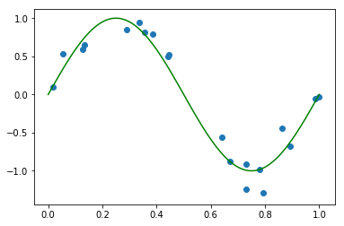


```python
x_train,x_test, y_train, y_test =model_selection.train_test_split(x, y, test_size=0.5, random_state=3)
train = {'X':x_train, 'Y': y_train}
train_data = pd.DataFrame(data = train, dtype=np.float)
print("Train_data")
print(train_data)
test = {'X':x_test, 'Y': y_test}
test_data = pd.DataFrame(data = test, dtype=np.float)
print("Test_data")
print(test_data)
```

    Train_data
              X         Y
    0  0.779908 -0.987445
    1  0.729094 -0.907299
    2  0.642076 -0.564558
    3  0.053960  0.528921
    4  0.356006  0.818036
    5  0.892764 -0.671459
    6  0.386308  0.792755
    7  0.016185  0.098541
    8  0.792941 -1.291879
    9  0.998719 -0.028403
    Test_data
              X         Y
    0  0.670314 -0.873847
    1  0.986043 -0.057054
    2  0.335999  0.945851
    3  0.290267  0.848232
    4  0.731091 -1.236395
    5  0.864188 -0.441978
    6  0.126396  0.595426
    7  0.132089  0.649272
    8  0.445654  0.518138
    9  0.441513  0.493468
    


```python
plt.scatter(x_train, y_train,label = 'train sample')
plt.scatter(x_test, y_test, c = 'r',label = 'test sample')
plt.plot(x_sin,y_sin,"g-")
plt.legend()
```


    <matplotlib.legend.Legend at 0x7f650a47e390>


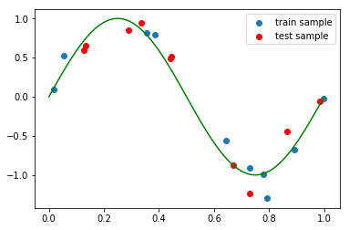


b.Using root mean square error, find weights of polynomial regression for order is 0, 1, 3, 9


```python
poly0 = PolynomialFeatures(0)
x_reshape= poly0.fit_transform(x_train.reshape(-1,1))
regressor_poly0 = LinearRegression()
regressor_poly0.fit(x_reshape,y_train)
coef0 = regressor_poly0.coef_
print(coef0)
W0 = [0]*10
for i in range(len(coef0)):
    W0[i] = coef0[i]


poly1 = PolynomialFeatures(1)
x_reshape= poly1.fit_transform(x_train.reshape(-1,1))
regressor_poly1 = LinearRegression()
regressor_poly1.fit(x_reshape,y_train)
coef1 = regressor_poly1.coef_
print(coef1)
W1 = [0]*10
for i in range(len(coef1)):
    W1[i] = coef1[i]

poly3 = PolynomialFeatures(3)
x_reshape= poly3.fit_transform(x_train.reshape(-1,1))
regressor_poly3 = LinearRegression()
regressor_poly3.fit(x_reshape,y_train)
coef3 = regressor_poly3.coef_
print(coef3)
W3 = [0]*10
for i in range(len(coef3)):
    W3[i] = coef3[i]

poly9 = PolynomialFeatures(9)
x_reshape= poly9.fit_transform(x_train.reshape(-1,1))
regressor_poly9 = LinearRegression()
regressor_poly9.fit(x_reshape,y_train)
coef9 = regressor_poly9.coef_
print(coef9)
W9 = [0]*10
for i in range(len(coef9)):
    W9[i] = coef9[i]

```

    [0.]
    [ 0.        -1.4738398]
    [  0.          12.55600166 -36.09875436  23.63593269]
    [ 0.00000000e+00 -4.10523466e+03  9.59807719e+04 -8.15375177e+05
      3.50685343e+06 -8.67892264e+06  1.29270693e+07 -1.14651520e+07
      5.58433459e+06 -1.15072896e+06]
    

c.Display weights in table 


```python
from prettytable import PrettyTable
x= PrettyTable()
x.add_column("label\order", ["W0","W1","W2","W3","W4","W5","W6","W7","W8","W9"])
x.add_column("0", W0)
x.add_column("1", W1)
x.add_column("3", W3)
x.add_column("9", W9)
print(x)
```

    +-------------+-----+---------------------+---------------------+---------------------+
    | label\order |  0  |          1          |          3          |          9          |
    +-------------+-----+---------------------+---------------------+---------------------+
    |      W0     | 0.0 |         0.0         |         0.0         |         0.0         |
    |      W1     |  0  | -1.4738397993882186 |  12.55600165544262  |  -4105.234657409737 |
    |      W2     |  0  |          0          | -36.098754356474295 |   95980.7719319019  |
    |      W3     |  0  |          0          |  23.635932688184308 |  -815375.1765700782 |
    |      W4     |  0  |          0          |          0          |  3506853.427300153  |
    |      W5     |  0  |          0          |          0          |  -8678922.640975766 |
    |      W6     |  0  |          0          |          0          |  12927069.333513057 |
    |      W7     |  0  |          0          |          0          | -11465152.001150133 |
    |      W8     |  0  |          0          |          0          |  5584334.587046051  |
    |      W9     |  0  |          0          |          0          | -1150728.9600270537 |
    +-------------+-----+---------------------+---------------------+---------------------+
    

d.Draw a chart of fit data

weights of polynomial regression for order is 0


```python
x = np.linspace(0, 1, 100)
x_reshape = poly0.fit_transform(x.reshape(-1, 1))
y = regressor_poly0.predict(x_reshape)
plt.plot(x, y,label="$M = 0$")
plt.scatter(x_train, y_train)
plt.scatter(x_test, y_test, c = 'r')
plt.plot(x_sin,y_sin,"g-")
plt.legend()
```


    <matplotlib.legend.Legend at 0x7f650a3cfdd8>


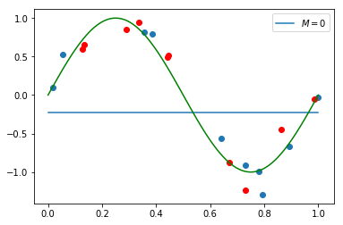


```python
x = np.linspace(0, 1, 100)
x_reshape = poly1.fit_transform(x.reshape(-1, 1))
y = regressor_poly1.predict(x_reshape)
plt.plot(x, y,label="$M = 1$")
plt.scatter(x_train, y_train)
plt.scatter(x_test, y_test, c = 'r')
plt.plot(x_sin,y_sin,"g-")
plt.legend()
```


    <matplotlib.legend.Legend at 0x7f650a4dd630>


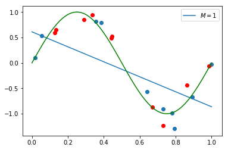


```python
x = np.linspace(0, 1, 100)
x_reshape = poly3.fit_transform(x.reshape(-1, 1))
y = regressor_poly3.predict(x_reshape)
plt.plot(x, y,label="$M = 3$")
plt.scatter(x_train, y_train)
plt.scatter(x_test, y_test, c = 'r')
plt.plot(x_sin,y_sin,"g-")
plt.legend()
```


    <matplotlib.legend.Legend at 0x7f650a29d908>


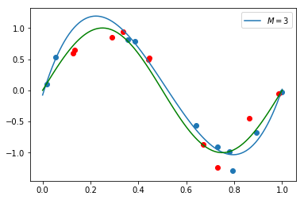


```python
x = np.linspace(0, 1, 100)
x_reshape = poly9.fit_transform(x.reshape(-1, 1))
y = regressor_poly9.predict(x_reshape)
plt.plot(x, y,label="$M = 9$")
plt.scatter(x_train, y_train)
plt.scatter(x_test, y_test, c = 'r')
plt.plot(x_sin,y_sin,"g-")
plt.ylim(-1.5 ,1.5)
plt.legend()
```


    <matplotlib.legend.Legend at 0x7f650a284908>


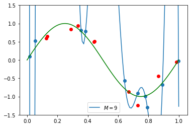


e. Draw train error vs test error


```python
import tensorflow as tf
def Error(x_train,x_test, y_train, y_test,rounds:int):
    ouput_train = [0]*rounds
    ouput_test = [0]*rounds
    for i in range(rounds):
        poly = PolynomialFeatures(i)
        x_train_reshape= poly.fit_transform(x_train.reshape(-1,1))
        x_test_reshape=poly.fit_transform(x_test.reshape(-1,1))
        regressor_poly = LinearRegression()
        regressor_poly.fit(x_train_reshape,y_train)
        yy_train = regressor_poly.predict(x_train_reshape)
        yy_test = regressor_poly.predict(x_test_reshape)
        MSE_train = tf.square(y_train - yy_train)
        MSE_test = tf.square(y_test - yy_test)
        ouput_train[i]= tf.reduce_mean(MSE_train).numpy()
        ouput_test[i]=tf.reduce_mean(MSE_test).numpy()
    return ouput_train,ouput_test
train_error , test_error = Error(x_train,x_test, y_train, y_test,10)

xx = np.linspace(0, 9, 10)    
plt.ylim(0 ,1)
plt.xlim(0,9)

plt.plot(xx, np.array(test_error), label = "$test error$", c = 'r')
plt.plot(xx, np.array(train_error), label = "$train error$", c = 'b')

plt.xlabel('Orders')

plt.ylabel('Error')
plt.legend()
```


    <matplotlib.legend.Legend at 0x7f64f4422fd0>


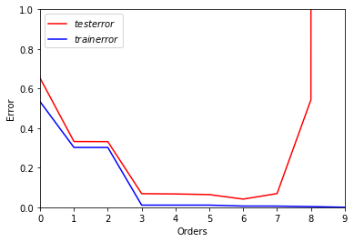


f. Generate 100 more data and fit 9th order model and draw fit


```python
x_100 = np.linspace(0,1,100)     
d_100 = np.random.normal(loc=0,scale=0.2,size=100)    
y_100 = 2*math.pi*x_100
for i in range(100):
    y_100[i] = math.sin(y_100[i])+ d_100[i]
data_1 = {'X':x_100, 'Y':y_100}
data_100 = pd.DataFrame(data = data_1, dtype=np.int8)
poly = PolynomialFeatures(9)
x_reshape = poly.fit_transform(x_100.reshape(-1,1))
regressor_poly = LinearRegression()
regressor_poly.fit(x_reshape, y_100)# train
xx_reshape = poly.fit_transform(x_100.reshape(-1, 1))
yy = regressor_poly.predict(xx_reshape)
plt.plot(x_100, yy,label="$M = 9$")
plt.scatter(x_100, y_100, c = "r")
plt.plot(x_sin,y_sin,"g-")
plt.legend()
```


    <matplotlib.legend.Legend at 0x7f650a2bd390>


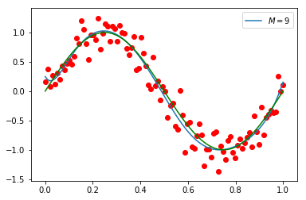


g. Regularize using the sum of weights.


```python
def train(Lambda):
    poly = PolynomialFeatures(9)
    x_reshape = poly.fit_transform(x_train.reshape(-1,1))
    regressor_poly = Ridge(Lambda)
    regressor_poly.fit(x_reshape,y_train)# train
    return regressor_poly

def regularize(Lambda):
    model = train(Lambda)
    xx = np.linspace(0, 1, 100)
    x_reshape = poly.fit_transform(xx.reshape(-1,1))
    yy = model.predict(x_reshape)
    plt.plot(xx, yy,label="$lambda = $"+ str(Lambda))
    plt.scatter(x_train, y_train)
    plt.scatter(x_test,y_test, c = 'r')
    plt.plot(x_sin,y_sin,"g-")
    plt.xlim(0 ,1)
    plt.ylim(-1.5 ,1.5)
    plt.legend()
```

h.Draw chart for lambda is 1, 1/10, 1/100, 1/1000, 1/10000, 1/100000 


```python
regularize(1)
```


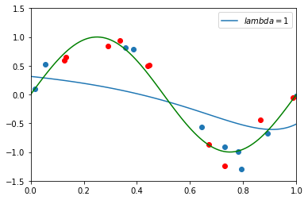


```python
regularize(0.1)
```


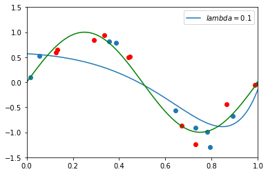


```python
regularize(0.001)
```


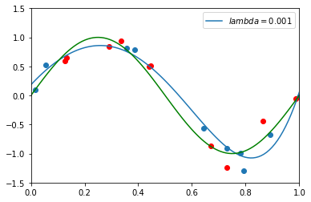


```python
regularize(0.0001)
```


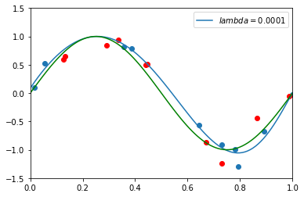


```python
regularize(0.00001)
```


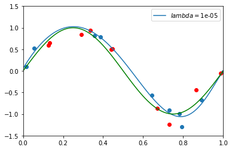


```python
regularize(0.000001)
```


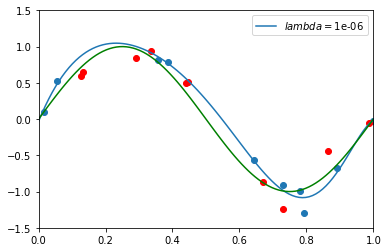


i. Draw test and train error according to lamda


```python
import tensorflow as tf
def Error1(x_train,x_test, y_train, y_test):
    ouput_train = [0]*20
    ouput_test = [0]*20
    for i in range(-20,0):
        if i < 0: Lambda = math.exp(i)
        poly = PolynomialFeatures(9)
        x_train_reshape= poly.fit_transform(x_train.reshape(-1,1))
        x_test_reshape=poly.fit_transform(x_test.reshape(-1,1))
        regressor_poly = Ridge(Lambda)
        regressor_poly.fit(x_train_reshape,y_train)
        yy_train = regressor_poly.predict(x_train_reshape)
        yy_test = regressor_poly.predict(x_test_reshape)
        MSE_train = tf.square(y_train - yy_train)
        MSE_test = tf.square(y_test - yy_test)
        ouput_train[i]= tf.reduce_mean(MSE_train).numpy()
        ouput_test[i]=tf.reduce_mean(MSE_test).numpy()
    return ouput_train,ouput_test

train_error , test_error = Error1(x_train,x_test, y_train, y_test)

xx = np.linspace(-20, 0, 20)
#print(xx)
plt.ylim(0 ,0.5)
plt.xlim(-20,0)

plt.plot(xx, np.array(test_error), label = "$test error$", c = 'r')
plt.plot(xx, np.array(train_error), label = "$train error$", c = 'b')

plt.xlabel('$ln(lambda)$')

plt.ylabel('Error')
plt.legend()
```


    <matplotlib.legend.Legend at 0x7f64f40db518>


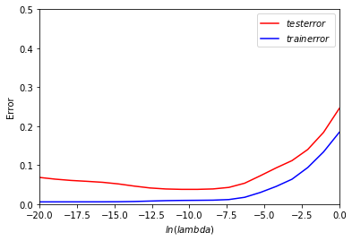


j.Based on the best test performance, what is your model? 


```python
best_lambda = 0
for i in range(-20,0):
    if test_error[i+20] == min(test_error):
        best_lambda = i
print('best_ln(lambda) = ' + str(best_lambda))
print('best_lambda = '+ str(math.exp(best_lambda)))
print("The best model is when "+'lambda is '+ str(math.exp(best_lambda)))
```

    best_ln(lambda) = -10
    best_lambda = 4.5399929762484854e-05
    The best model is when lambda is 4.5399929762484854e-05
    


```python

```
