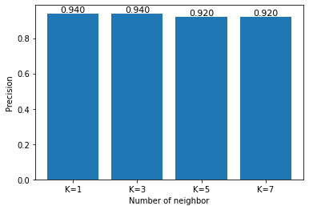

{}Download my files{}

```
import pandas as pd
import numpy as np
import math
import random
from sklearn.utils import shuffle
import sklearn.metrics as metrics
import matplotlib.pyplot as plt
```

a.Divide the dataset as development and test.


```
def mean_std(x):
  x = np.array(x).astype(np.float)
  y = np.std(x,axis=0)
  z = np.mean(x,axis=0)
  return y,z

def data():
  x_train = []
  y_test = []
  train_data = []
  with open("./assignment2/iris.data") as f:
    for line in f.read().splitlines():
      line = line.split(',')
      train_data.append(line)
    df = pd.DataFrame(train_data,columns=['sepal_length','sepal_width','petal_length','petal_width','class'])
    df = shuffle(df)
    print('Train_set:')
    print(df[:100])
    print('Dev_set:')
    print(df[100:125])
    print('Test_set:')
    print(df[125:])
    x_train = df.values[:50,:-1]
    y_train = df.values[:50,-1]
    x_dev = df.values[50:100,:-1]
    y_dev = df.values[50:100,-1]
    x_test = df.values[100:,:-1]
    y_test = df.values[100:,-1]
    return x_train,y_train,x_dev,y_dev,x_test,y_test
x_train,y_train,x_dev,y_dev,x_test,y_test = data()

x_train_m,x_train_s = mean_std(x_train)
x_dev_m,x_dev_s = mean_std(x_dev)
x_test_m,x_test_s = mean_std(x_test)
```

    Train_set:
        sepal_length sepal_width petal_length petal_width            class
    73           6.1         2.8          4.7         1.2  Iris-versicolor
    53           5.5         2.3          4.0         1.3  Iris-versicolor
    65           6.7         3.1          4.4         1.4  Iris-versicolor
    100          6.3         3.3          6.0         2.5   Iris-virginica
    12           4.8         3.0          1.4         0.1      Iris-setosa
    ..           ...         ...          ...         ...              ...
    114          5.8         2.8          5.1         2.4   Iris-virginica
    38           4.4         3.0          1.3         0.2      Iris-setosa
    62           6.0         2.2          4.0         1.0  Iris-versicolor
    32           5.2         4.1          1.5         0.1      Iris-setosa
    59           5.2         2.7          3.9         1.4  Iris-versicolor
    
    [100 rows x 5 columns]
    Dev_set:
        sepal_length sepal_width petal_length petal_width            class
    63           6.1         2.9          4.7         1.4  Iris-versicolor
    145          6.7         3.0          5.2         2.3   Iris-virginica
    86           6.7         3.1          4.7         1.5  Iris-versicolor
    0            5.1         3.5          1.4         0.2      Iris-setosa
    50           7.0         3.2          4.7         1.4  Iris-versicolor
    27           5.2         3.5          1.5         0.2      Iris-setosa
    137          6.4         3.1          5.5         1.8   Iris-virginica
    144          6.7         3.3          5.7         2.5   Iris-virginica
    13           4.3         3.0          1.1         0.1      Iris-setosa
    47           4.6         3.2          1.4         0.2      Iris-setosa
    106          4.9         2.5          4.5         1.7   Iris-virginica
    123          6.3         2.7          4.9         1.8   Iris-virginica
    143          6.8         3.2          5.9         2.3   Iris-virginica
    94           5.6         2.7          4.2         1.3  Iris-versicolor
    22           4.6         3.6          1.0         0.2      Iris-setosa
    55           5.7         2.8          4.5         1.3  Iris-versicolor
    74           6.4         2.9          4.3         1.3  Iris-versicolor
    101          5.8         2.7          5.1         1.9   Iris-virginica
    107          7.3         2.9          6.3         1.8   Iris-virginica
    30           4.8         3.1          1.6         0.2      Iris-setosa
    43           5.0         3.5          1.6         0.6      Iris-setosa
    93           5.0         2.3          3.3         1.0  Iris-versicolor
    25           5.0         3.0          1.6         0.2      Iris-setosa
    85           6.0         3.4          4.5         1.6  Iris-versicolor
    29           4.7         3.2          1.6         0.2      Iris-setosa
    Test_set:
        sepal_length sepal_width petal_length petal_width            class
    52           6.9         3.1          4.9         1.5  Iris-versicolor
    148          6.2         3.4          5.4         2.3   Iris-virginica
    76           6.8         2.8          4.8         1.4  Iris-versicolor
    9            4.9         3.1          1.5         0.1      Iris-setosa
    46           5.1         3.8          1.6         0.2      Iris-setosa
    89           5.5         2.5          4.0         1.3  Iris-versicolor
    78           6.0         2.9          4.5         1.5  Iris-versicolor
    90           5.5         2.6          4.4         1.2  Iris-versicolor
    39           5.1         3.4          1.5         0.2      Iris-setosa
    45           4.8         3.0          1.4         0.3      Iris-setosa
    33           5.5         4.2          1.4         0.2      Iris-setosa
    113          5.7         2.5          5.0         2.0   Iris-virginica
    109          7.2         3.6          6.1         2.5   Iris-virginica
    110          6.5         3.2          5.1         2.0   Iris-virginica
    40           5.0         3.5          1.3         0.3      Iris-setosa
    66           5.6         3.0          4.5         1.5  Iris-versicolor
    131          7.9         3.8          6.4         2.0   Iris-virginica
    24           4.8         3.4          1.9         0.2      Iris-setosa
    54           6.5         2.8          4.6         1.5  Iris-versicolor
    133          6.3         2.8          5.1         1.5   Iris-virginica
    11           4.8         3.4          1.6         0.2      Iris-setosa
    3            4.6         3.1          1.5         0.2      Iris-setosa
    42           4.4         3.2          1.3         0.2      Iris-setosa
    97           6.2         2.9          4.3         1.3  Iris-versicolor
    129          7.2         3.0          5.8         1.6   Iris-virginica
    

b.Implement KNN using the following hyperparameters

number of neighbor K 
1,3,5,7

distance metric

euclidean distance, normalized euclidean distance, cosine similarity


```
def euclidean(input1,input2):
  input1 = np.array(input1).astype(np.float)
  input2 = np.array(input2).astype(np.float)
  distants = np.sqrt(np.sum(np.square(np.subtract(input1,input2))))
  return distants

def normalized_euclidean(input1,input2):
  input1 = (np.array(input1).astype(np.float)-x_dev_m.astype(np.float))/x_dev_s.astype(np.float)
  input2 = (np.array(input2).astype(np.float)-x_train_m.astype(np.float))/x_train_s.astype(np.float)
  distants = np.sqrt(np.sum(np.square(np.subtract(input1,input2))))
  return distants

def cosine(input1,input2):
  input1 = np.array(input1).astype(np.float)
  input2 = np.array(input2).astype(np.float)
  distants = -np.dot(input1,input2)/(np.linalg.norm(input1)*np.linalg.norm(input2))
  return distants
```


```
def KNN(input,data_set,data_set_label,k:int,model:int):
  result = []
  for i in input:
    distance = [] #distance between input i and every sample in the training set
    for j in data_set:
      if model == 1:
        d = euclidean(i,j)
      elif model == 2:
        d = normalized_euclidean(i,j)
      elif model == 3:
        d = cosine(i,j)
      distance.append(d)
    knn = sorted(distance)[:k] #find k neighbour
    knn_label = []
    index = []
    knn_count = {}
    for q in knn: # find k neighbour label
       index.append(distance.index(q))
       knn_label.append(data_set_label[distance.index(q)])
    for i in knn_label:
      if i not in knn_count.keys():
        knn_count[i] = knn_label.count(i)
    res = max(knn_count,key=lambda x:knn_count[x])
    # print(knn_count)
    # print(res)
    result.append(res)
  return result
#print(label)
```

c.Using the development dataset

1.Calculate accuracy by iterating all of the development data point

2.Find optimal hyperparameters

3.Draw bar charts for accuracy


Euclidean distance


```
label1 = KNN(x_dev,x_train,y_train,1,1)
label2 = KNN(x_dev,x_train,y_train,3,1)
label3 = KNN(x_dev,x_train,y_train,5,1)
label4 = KNN(x_dev,x_train,y_train,7,1)
result1 = metrics.accuracy_score(y_dev,label1)
result2 = metrics.accuracy_score(y_dev,label2)
result3 = metrics.accuracy_score(y_dev,label3)
result4 = metrics.accuracy_score(y_dev,label4)
print("K=1:"+str(result1))
print("K=3:"+str(result2))
print("K=5:"+str(result3))
print("K=7:"+str(result4))
name = ['K=1','K=3','K=5','K=7']
result = [result1,result2,result3,result4]
plt.bar(name,result)
plt.xlabel('Number of neighbor')
plt.ylabel('Precision')
for a, b in zip(name, result):
 plt.text(a, b, '%.3f' % b, ha='center', va='bottom', fontsize=11)
plt.show()
```

    K=1:0.92
    K=3:0.9
    K=5:0.88
    K=7:0.9
    


Normalized euclidean distance


```
label1 = KNN(x_dev,x_train,y_train,1,2)
label2 = KNN(x_dev,x_train,y_train,3,2)
label3 = KNN(x_dev,x_train,y_train,5,2)
label4 = KNN(x_dev,x_train,y_train,7,2)
result1 = metrics.accuracy_score(y_dev,label1)
result2 = metrics.accuracy_score(y_dev,label2)
result3 = metrics.accuracy_score(y_dev,label3)
result4 = metrics.accuracy_score(y_dev,label4)
print("K=1:"+str(result1))
print("K=3:"+str(result2))
print("K=5:"+str(result3))
print("K=7:"+str(result4))
name = ['K=1','K=3','K=5','K=7']
result = [result1,result2,result3,result4]
plt.bar(name,result)
plt.xlabel('Number of neighbor')
plt.ylabel('Precision')
for a, b in zip(name, result):
 plt.text(a, b, '%.3f' % b, ha='center', va='bottom', fontsize=11)
plt.show()
```

    K=1:0.94
    K=3:0.94
    K=5:0.92
    K=7:0.92
    





Cosine similarity


```
label1 = KNN(x_dev,x_train,y_train,1,3)
label2 = KNN(x_dev,x_train,y_train,3,3)
label3 = KNN(x_dev,x_train,y_train,5,3)
label3 = KNN(x_dev,x_train,y_train,7,3)
result1 = metrics.accuracy_score(y_dev,label1)
result2 = metrics.accuracy_score(y_dev,label2)
result3 = metrics.accuracy_score(y_dev,label3)
result4 = metrics.accuracy_score(y_dev,label4)
print("K=1:"+str(result1))
print("K=3:"+str(result2))
print("K=5:"+str(result3))
print("K=7:"+str(result4))
name = ['K=1','K=3','K=5','K=7']
result = [result1,result2,result3,result4]
plt.bar(name,result)
plt.xlabel('Number of neighbor')
plt.ylabel('Precision')
for a, b in zip(name, result):
 plt.text(a, b, '%.3f' % b, ha='center', va='bottom', fontsize=11)
plt.show()
```

    K=1:0.94
    K=3:0.9
    K=5:0.86
    K=7:0.92
    


So we choose the best perfomance model:

Normalized euclidean distance

Number of neibhbor: K=3

d.Using the test dataset


```
label = KNN(x_test,x_train,y_train,3,3)
result = metrics.accuracy_score(y_test,label)
print("Precision:"+str(result))
```

    Precision:0.96
    
