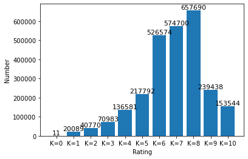
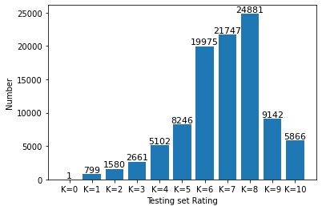
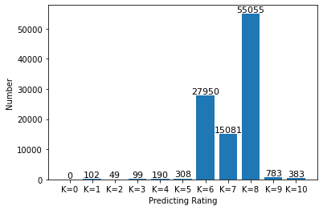

# **<center> Comment Rating System </center>**

**Term Project** 
**Student ID:** 1001780927  
**Name:** Weixiao Sang  
**Demo Website:** https://comment-rating-system.herokuapp.com/  
**YouTube:** https://www.youtube.com/watch?v=HJgQNCyVGXA&feature=youtu.be  
**Kaggle:** https://www.kaggle.com/weixiaosang/commentrating?scriptVersionId=33836194

## **Introduction**  
The goal is given the review, predict the rating. We use board game geek review data.In this project, I use naive bayes to train my classifier.First step is preprocessing, preprocessing is data cleaning, In this step, we need to remove meaningless parts in comments, such as, punctuation, meaningless word.Those parts is useless for classification, they take up storage space and reduce classification accuracy.After preprocessing, I use three different trainset to train three different naive bayes classifiers.I do this because I want to use Ensemble Methods to improve the classifier performance.In the final, I analyze the classification results.

## **Library Import**


```python
import numpy as np
import pandas as pd
import math
import re
import random
from csv import reader
from nltk.corpus import stopwords
from sklearn.naive_bayes import MultinomialNB
from sklearn.svm import LinearSVC
from sklearn.metrics import accuracy_score
from sklearn.model_selection import train_test_split
from sklearn import feature_extraction, linear_model, model_selection, preprocessing
```

## **Data Analysis**  
### Step1: Read data  
We can see there are many useless data in this data set(no comment rating).


```python
data = pd.read_csv('boardgamegeek-reviews/bgg-13m-reviews.csv')
data[:10]
```


<div>
<style scoped>
    .dataframe tbody tr th:only-of-type {
        vertical-align: middle;
    }

    .dataframe tbody tr th {
        vertical-align: top;
    }

    .dataframe thead th {
        text-align: right;
    }
</style>
<table border="1" class="dataframe">
  <thead>
    <tr style="text-align: right;">
      <th></th>
      <th>Unnamed: 0</th>
      <th>user</th>
      <th>rating</th>
      <th>comment</th>
      <th>ID</th>
      <th>name</th>
    </tr>
  </thead>
  <tbody>
    <tr>
      <th>0</th>
      <td>0</td>
      <td>sidehacker</td>
      <td>10.0</td>
      <td>NaN</td>
      <td>13</td>
      <td>Catan</td>
    </tr>
    <tr>
      <th>1</th>
      <td>1</td>
      <td>Varthlokkur</td>
      <td>10.0</td>
      <td>NaN</td>
      <td>13</td>
      <td>Catan</td>
    </tr>
    <tr>
      <th>2</th>
      <td>2</td>
      <td>dougthonus</td>
      <td>10.0</td>
      <td>Currently, this sits on my list as my favorite...</td>
      <td>13</td>
      <td>Catan</td>
    </tr>
    <tr>
      <th>3</th>
      <td>3</td>
      <td>cypar7</td>
      <td>10.0</td>
      <td>I know it says how many plays, but many, many ...</td>
      <td>13</td>
      <td>Catan</td>
    </tr>
    <tr>
      <th>4</th>
      <td>4</td>
      <td>ssmooth</td>
      <td>10.0</td>
      <td>NaN</td>
      <td>13</td>
      <td>Catan</td>
    </tr>
    <tr>
      <th>5</th>
      <td>5</td>
      <td>Halloran</td>
      <td>10.0</td>
      <td>NaN</td>
      <td>13</td>
      <td>Catan</td>
    </tr>
    <tr>
      <th>6</th>
      <td>6</td>
      <td>isamu</td>
      <td>10.0</td>
      <td>NaN</td>
      <td>13</td>
      <td>Catan</td>
    </tr>
    <tr>
      <th>7</th>
      <td>7</td>
      <td>hreimer</td>
      <td>10.0</td>
      <td>i will never tire of this game.. Awesome</td>
      <td>13</td>
      <td>Catan</td>
    </tr>
    <tr>
      <th>8</th>
      <td>8</td>
      <td>ericgorr</td>
      <td>10.0</td>
      <td>NaN</td>
      <td>13</td>
      <td>Catan</td>
    </tr>
    <tr>
      <th>9</th>
      <td>9</td>
      <td>butch</td>
      <td>10.0</td>
      <td>NaN</td>
      <td>13</td>
      <td>Catan</td>
    </tr>
  </tbody>
</table>
</div>


### Step2: Preprocessing,Remove the punctuation and stopword and no comment data, lowercase. Remove useless row. The rating scores are rounded into 11 different classes


```python
data_drict = 'boardgamegeek-reviews/bgg-13m-reviews.csv'
stopwords = (stopwords.words('english'))

with open(data_drict,'r',encoding='utf-8') as f:
    row_data = reader(f)
    review = []
    rate = []
    for row in row_data:
        if  row[0] != '' and row[3] !='':
            rate.append(round(float(row[2])))
            content = row[3].lower()
            content = content.replace("\r", "").strip()  
            content = content.replace("\n", "").strip()
            content = re.sub("[%s]+"%('.,|?|!|:|;\"\-|#|$|%|&|\|(|)|*|+|-|/|<|=|>|@|^|`|{|}|~\[\]'), "", content)
            sentence = content.split(' ')
            for i in stopwords:
                while i in sentence:
                    sentence.remove(i)
            content = ' '.join(sentence)
            review.append(content)
```


```python
print('Original data size:'+str(len(data)))

print('Vaild data size:'+str(len(review)))
cnt = 11*[0]
for i in range(11):
    cnt[i] = rate.count(i)
```

    Original data size:13170073
    Vaild data size:2638172
    

We can see there only about 1/6 useful data, and the useful sample distribution is very uneven.There are only 11 zero Rating score sample. I guess this will result in very unsatisfactory training results.


```python
import matplotlib.pyplot as plt

name = ['K=0','K=1','K=2','K=3','K=4','K=5','K=6','K=7','K=8','K=9','K=10']
plt.bar(name,cnt)
plt.xlabel('Rating')
plt.ylabel('Number')
for a, b in zip(name, cnt):
 plt.text(a, b, '%d' % b, ha='center', va='bottom', fontsize=11)
plt.show()
```





### Step4: Split train and testing data set


```python
x_train,x_test, y_train, y_test = train_test_split(review,rate,test_size=0.3, random_state=0)
```


```python
print('Trainset_size:')
print(len(x_train))
print('Testingset_size:')
print(len(x_test))
```

    Trainset_size:
    1846720
    Testingset_size:
    791452
    

We split trainset to three different set to train different classifier.


```python
x_0 = x_train[:100000]
y_0 = y_train[:100000]
x_1 = x_train[100000:200000]
y_1 = y_train[100000:200000]
x_2 = x_train[200000:300000]
y_2 = y_train[200000:300000]
x_test = x_test[:100000]
y_test = y_test[:100000]

test_y = np.asarray(y_test)
```

### Step5: Train 3 different naive bayes classifier


```python
vectorizer0 = feature_extraction.text.CountVectorizer()
train0_x = vectorizer0.fit_transform(x_0)
train0_y = np.asarray(y_0)

test_x = vectorizer0.transform(x_test)

NB0 = MultinomialNB()
NB0.fit(train0_x,train0_y)

pred0 = NB0.predict(test_x)
acc_0 = accuracy_score(test_y,pred0)
```


```python
print('The first NB classifier precision is '+ str(acc_0))
```

    The first NB classifier precision is 0.3013
    


```python
vectorizer1 = feature_extraction.text.CountVectorizer()
train1_x = vectorizer1.fit_transform(x_1)
train1_y = np.asarray(y_1)

test_x = vectorizer1.transform(x_test)

NB1 = MultinomialNB()
NB1.fit(train1_x,train1_y)

pred1 = NB1.predict(test_x)
acc_1 = accuracy_score(test_y,pred1)
```


```python
print('The second NB classifier precision is '+ str(acc_1))
```

    The second NB classifier precision is 0.29945
    


```python
vectorizer2 = feature_extraction.text.CountVectorizer()
train2_x = vectorizer2.fit_transform(x_2)
train2_y = np.asarray(y_2)

test_x = vectorizer2.transform(x_test)

NB2 = MultinomialNB()
NB2.fit(train2_x,train2_y)

pred2 = NB2.predict(test_x)
acc_2 = accuracy_score(test_y,pred2)

```


```python
print('The third NB classifier precision is '+ str(acc_2))
```

    The third NB classifier precision is 0.30012
    

### Step 6: Ensemble Methods
Then I use Ensemble Methods to predict the result. I take the most common predicting result among the three classifier results as the final classification result.


```python
result = []
for i in range(len(test_y)):
    pred = []
    pred.append(pred0[i])
    pred.append(pred1[i])
    pred.append(pred2[i])
    tmp = dict((a, pred.count(a)) for a in pred)
    top = sorted(tmp.items() , key=lambda tmp:tmp[1] ,reverse= True)
    result.append(top[0][0])
```


```python
acc = accuracy_score(test_y,result)
```


```python
print('The combining NB classifier precision is '+str(acc))
```

    The combining NB classifier precision is 0.30734
    

We can see the Ensemble Methods has 2.6% improvement than traditional naive bayes classifier.

## Experiment

We can see that the classifier doesn't work very well, the precision is only 30%. I try to analyze why.

We can see testing set distribution, most of the data is distributed in 6,7,8 rating score. In the predicting result, we can see most of the predicting is still distributed in 6,7,8 rating score. And the 8 rating score absorb most of the predictions. I analyze why this happened.

- Uneven sample distribution results in uneven distribution of the number of features in each class, the more samples there are, the more features there are, so the class with a large sample has a better chance of extracting good features.
- 7 rating score class feature words are similar to 6 , 8 rating class, but 6, 8 feature words are different , so part of 7 rating samples are divided to 8 and 9 rating class, this happens to every two adjacent classes.


```python
test_y = list(test_y)
cnt = 11*[0]
for i in range(11):
    cnt[i] = test_y.count(i)

name = ['K=0','K=1','K=2','K=3','K=4','K=5','K=6','K=7','K=8','K=9','K=10']
plt.bar(name,cnt)
plt.xlabel('Testing set Rating')
plt.ylabel('Number')
for a, b in zip(name, cnt):
 plt.text(a, b, '%d' % b, ha='center', va='bottom', fontsize=11)
plt.show()
```





```python
cnt = 11*[0]
for i in range(11):
    cnt[i] = result.count(i)

name = ['K=0','K=1','K=2','K=3','K=4','K=5','K=6','K=7','K=8','K=9','K=10']
plt.bar(name,cnt)
plt.xlabel('Predicting Rating')
plt.ylabel('Number')
for a, b in zip(name, cnt):
 plt.text(a, b, '%d' % b, ha='center', va='bottom', fontsize=11)
plt.show()
```





As I said, 7 rating score class feature words are similar to 6 , 8 rating class, but 6, 8 feature words are different , so part of 7 rating samples are divided to 8 and 9 rating class, this happens to every two adjacent classes. So, To test this hypothesis, I do the following experiment, I keep the rating error of plus or minus two, it means if 7 is classified as 6 or 8, I think it is right.


```python
result1 = []
for i in range(len(test_y)):
    Min = test_y[i] - 1.1
    Max = test_y[i] + 1.1
    if result[i]>Min and result[i]<Max:
        pd = 1
    else:
        pd = 0
    result1.append(pd)
```


```python
final_acc1 = result1.count(1) / len(test_y)
print('If we keep the rating error of plus or minus one:')
print('Final precision is '+str(final_acc1))
```

    If we keep the rating error of plus or minus one:
    Final precision is 0.67312
    

We can see the precision is improved. If we keep the rating error of plus or minus two. And the precision is 0.88714. This result confirms my guess.


```python
result2 = []
for i in range(len(test_y)):
    Min = test_y[i] - 2.1
    Max = test_y[i] + 2.1
    if result[i]>Min and result[i]<Max:
        pd = 1
    else:
        pd = 0
    result2.append(pd)

final_acc2 = result2.count(1) / len(test_y)
print('If we keep the rating error of plus or minus two:')
print('Final precision is '+str(final_acc2))
```

    If we keep the rating error of plus or minus two:
    Final precision is 0.88714
    

### Step7: Save model


```python
from sklearn.externals import joblib
joblib.dump(NB0,  "model/NB0.pkl")
joblib.dump(vectorizer0,  "model/vectorizer0.pkl")
joblib.dump(NB0,  "model/NB1.pkl")
joblib.dump(vectorizer0,  "model/vectorizer1.pkl")
joblib.dump(NB0,  "model/NB2.pkl")
joblib.dump(vectorizer0,  "model/vectorizer2.pkl")
```


    ['model/vectorizer2.pkl']


## conclusion

- I preprocessed the data set
- I trained naive bayes classifier
- Ensemble Methods can improve the performance of classifier
- Uneven training sets can have a negative effect on training

## REFERENCES
https://scikit-learn.org/stable/modules/naive_bayes.html  
https://blog.statsbot.co/ensemble-learning-d1dcd548e936
